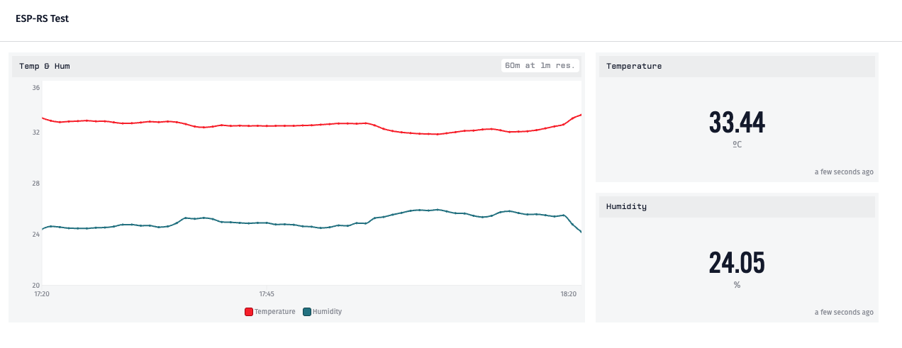

# Losant Example

[](https://github.com/SergioGasquez/losant-example/actions/workflows/ci.yaml)

Simple example built for [esp-rust-board](https://github.com/esp-rs/esp-rust-board) that sends temperature and humidity to
Losant, via MQTT, where it can be [visualized in this dashboard](https://app.losant.com/dashboards/6317314b80eae13991afeb09).



If you want to reproduce this example:
1. [Sign in or create an account](https://accounts.losant.com/signin).
2. [Create a standalone Losant device with the proper atributes (in this case `humidity` and `temperature`)](https://docs.losant.com/devices/overview/)
3. [Create Losant access key and secret](https://docs.losant.com/applications/access-keys/)
4. Rename `cfg.toml.example` to `cfg.toml`
5. Fill the `cfg.toml` with
   1. `wifi_ssid`: Wifi SSID
   2. `wifi_pass`: Wifi password
   3. `client_id`: Losant device ID
   4. `username`: Losant access key
   5. `password`: Losant access secret
6. [Create a Losant dashboard](https://docs.losant.com/dashboards/overview/)

## Dev Containers
This repository offers Dev Containers supports for:
-  [Gitpod](https://gitpod.io/)
   - ["Open in Gitpod" button](https://www.gitpod.io/docs/getting-started#open-in-gitpod-button)
-  [VS Code Dev Containers](https://code.visualstudio.com/docs/remote/containers#_quick-start-open-an-existing-folder-in-a-container)
-  [GitHub Codespaces](https://docs.github.com/en/codespaces/developing-in-codespaces/creating-a-codespace)
> **Note**
>
> In order to use Gitpod the project needs to be published in a GitLab, GitHub,
> or Bitbucket repository.
>
> In [order to use GitHub Codespaces](https://github.com/features/codespaces#faq)
> the project needs to be published in a GitHub repository and the user needs
> to be part of the Codespaces beta or have the project under an organization.

If using VS Code or GitHub Codespaces, you can pull the image instead of building it
from the Dockerfile by selecting the `image` property instead of `build` in
`.devcontainer/devcontainer.json`. Further customization of the Dev Container can
be achived, see [.devcontainer.json reference](https://code.visualstudio.com/docs/remote/devcontainerjson-reference).

When using Dev Containers, some tooling to facilitate building, flashing and
simulating in Wokwi is also added.
### Build
- Terminal approach:

    ```
    scripts/build.sh  [debug | release]
    ```
    > If no argument is passed, `release` will be used as default


-  UI approach:

    The default build task is already set to build the project, and it can be used
    in VS Code and Gitpod:
    - From the [Command Palette](https://code.visualstudio.com/docs/getstarted/userinterface#_command-palette) (`Ctrl-Shift-P` or `Cmd-Shift-P`) run the `Tasks: Run Build Task` command.
    - `Terminal`-> `Run Build Task` in the menu.
    - With `Ctrl-Shift-B` or `Cmd-Shift-B`.
    - From the [Command Palette](https://code.visualstudio.com/docs/getstarted/userinterface#_command-palette) (`Ctrl-Shift-P` or `Cmd-Shift-P`) run the `Tasks: Run Task` command and
    select `Build`.
    - From UI: Press `Build` on the left side of the Status Bar.

### Flash

> **Note**
>
> When using GitHub Codespaces, we need to make the ports
> public, [see instructions](https://docs.github.com/en/codespaces/developing-in-codespaces/forwarding-ports-in-your-codespace#sharing-a-port).

- Terminal approach:
  - Using `flash.sh` script:

    ```
    scripts/flash.sh [debug | release]
    ```
    > If no argument is passed, `release` will be used as default

- UI approach:
    - From the [Command Palette](https://code.visualstudio.com/docs/getstarted/userinterface#_command-palette) (`Ctrl-Shift-P` or `Cmd-Shift-P`) run the `Tasks: Run Task` command and
    select `Build & Flash`.
    - From UI: Press `Build & Flash` on the left side of the Status Bar.
- Any alternative flashing method from host machine.


### Wokwi Simulation
When using a custom Wokwi project, please change the `WOKWI_PROJECT_ID` in
`run-wokwi.sh`. If no project id is specified, a DevKit for esp32c3 will be
used.
> **Warning**
>
>  ESP32-S3 is not available in Wokwi

- Terminal approach:

    ```
    scripts/run-wokwi.sh [debug | release]
    ```
    > If no argument is passed, `release` will be used as default

- UI approach:

    The default test task is already set to build the project, and it can be used
    in VS Code and Gitpod:
    - From the [Command Palette](https://code.visualstudio.com/docs/getstarted/userinterface#_command-palette) (`Ctrl-Shift-P` or `Cmd-Shift-P`) run the `Tasks: Run Test Task` command
    - With `Ctrl-Shift-,` or `Cmd-Shift-,`
        > **Note**
        >
        > This Shortcut is not available in Gitpod by default.
    - From the [Command Palette](https://code.visualstudio.com/docs/getstarted/userinterface#_command-palette) (`Ctrl-Shift-P` or `Cmd-Shift-P`) run the `Tasks: Run Task` command and
    select `Build & Run Wokwi`.
    - From UI: Press `Build & Run Wokwi` on the left side of the Status Bar.

> **Warning**
>
>  The simulation will pause if the browser tab is in the background.This may
> affect the execution, specially when debuging.

#### Debuging with Wokwi

Wokwi offers debugging with GDB.

- Terminal approach:
    ```
    $HOME/.espressif/tools/riscv32-esp-elf/esp-2021r2-patch3-8.4.0/riscv32-esp-elf/bin/riscv32-esp-elf-gdb target/riscv32imc-esp-espidf/debug/losant_example -ex "target remote localhost:9333"
    ```

    > [Wokwi Blog: List of common GDB commands for debugging.](https://blog.wokwi.com/gdb-avr-arduino-cheatsheet/?utm_source=urish&utm_medium=blog)
- UI approach:
    1. Run the Wokwi Simulation in `debug` profile
    2. Go to `Run and Debug` section of the IDE (`Ctrl-Shift-D or Cmd-Shift-D`)
    3. Start Debugging by pressing the Play Button or pressing `F5`
    4. Choose the proper user:
        - `esp` when using VS Code or GitHub Codespaces
        - `gitpod` when using Gitpod
